# Precision Multi-Class Irrigation Intelligence
> **Live Project:** [Open the deployed application](https://precision-multiclass-irrigation.onrender.com/)


> **End-to-end machine learning system for predicting crop-field irrigation requirements as Low, Medium, or High — from data preprocessing and model evaluation to a deployable XGBoost + Flask inference service.**

---

## Project Overview

**Precision Multi-Class Irrigation Intelligence** is a multi-class classification project designed to predict the irrigation requirement of a crop field.

The target variable is:

```text
Irrigation_Need
```

with three classes:

| Encoded Class | Irrigation Need |
|:---:|---|
| `0` | **High** |
| `1` | **Low** |
| `2` | **Medium** |

The project follows a complete ML lifecycle:

**Raw Agricultural Data → Preprocessing → Encoding → Stratified Split → SMOTE → Model Training → Validation → Final Test Evaluation → Model Selection → Explainability → Model Serialization → Flask API → Deployment**

---

# System Architecture

The architecture is divided into five logical layers.

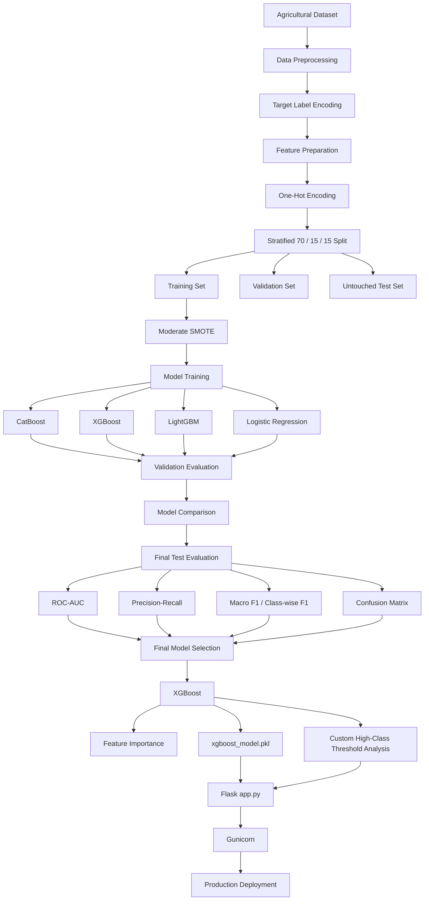
```mermaid
flowchart TD
    A["Agricultural Dataset"] --> B["Data Preprocessing"]
    B --> C["Target Label Encoding"]
    C --> D["Feature Preparation"]
    D --> E["One-Hot Encoding"]

    E --> F["Stratified 70 / 15 / 15 Split"]

    F --> G["Training Set"]
    F --> H["Validation Set"]
    F --> I["Untouched Test Set"]

    G --> J["Moderate SMOTE"]
    J --> K["Model Training"]

    K --> K1["CatBoost"]
    K --> K2["XGBoost"]
    K --> K3["LightGBM"]
    K --> K4["Logistic Regression"]

    K1 --> L["Validation Evaluation"]
    K2 --> L
    K3 --> L
    K4 --> L

    L --> M["Model Comparison"]
    M --> N["Final Test Evaluation"]

    N --> O["ROC-AUC"]
    N --> P["Precision-Recall"]
    N --> Q["Macro F1 / Class-wise F1"]
    N --> R["Confusion Matrix"]

    O --> S["Final Model Selection"]
    P --> S
    Q --> S
    R --> S

    S --> T["XGBoost"]
    T --> U["Feature Importance"]
    T --> V["Custom High-Class Threshold Analysis"]
    T --> W["xgboost_model.pkl"]
    W --> X["Flask app.py"]
    V --> X
    X --> Y["Gunicorn"]
    Y --> Z["Production Deployment"]
```

---

# Complete ML Workflow

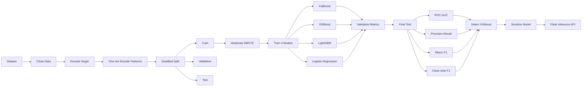
```mermaid
flowchart LR
    A["Dataset"] --> B["Clean Data"]
    B --> C["Encode Target"]
    C --> D["One-Hot Encode Features"]
    D --> E["Stratified Split"]

    E --> F["Train"]
    E --> G["Validation"]
    E --> H["Test"]

    F --> I["Moderate SMOTE"]
    I --> J["Train 4 Models"]

    J --> K["CatBoost"]
    J --> L["XGBoost"]
    J --> M["LightGBM"]
    J --> N["Logistic Regression"]

    K --> O["Validation Metrics"]
    L --> O
    M --> O
    N --> O

    O --> P["Final Test"]
    P --> Q["ROC-AUC"]
    P --> R["Precision-Recall"]
    P --> S["Macro F1"]
    P --> T["Class-wise F1"]

    Q --> U["Select XGBoost"]
    R --> U
    S --> U
    T --> U

    U --> V["Serialize Model"]
    V --> W["Flask Inference API"]
```

---

# 1. Original Class Distribution

The original dataset contains a significant class imbalance:

| Irrigation Need | Samples |
|---|---:|
| **Low** | 369,917 |
| **Medium** | 239,074 |
| **High** | 21,009 |
| **Total** | **630,000** |

The **High** class is substantially smaller than the Low and Medium classes, which motivated the use of controlled oversampling on the training data.

### Class Distribution

<figure>
  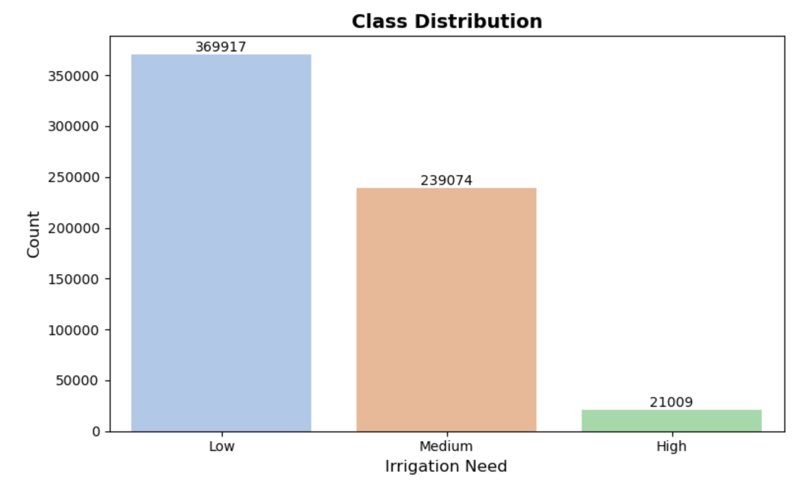
  <figcaption><b>Figure 1 — Original Irrigation Need Class Distribution</b></figcaption>
</figure>

---

# 2. Feature Correlation Analysis

A correlation matrix was generated for the numerical features to inspect linear relationships and potential redundancy.

The displayed numerical features include:

- Soil pH
- Soil Moisture
- Organic Carbon
- Electrical Conductivity
- Temperature
- Humidity
- Rainfall
- Sunlight Hours
- Wind Speed
- Field Area
- Previous Irrigation

The observed pairwise correlations are generally close to zero, indicating that the numerical predictors do not exhibit strong linear multicollinearity in this dataset.

<figure>
  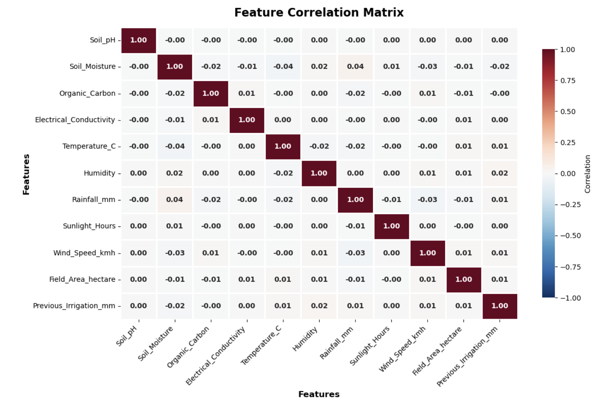
  <figcaption><b>Figure 2 — Numerical Feature Correlation Matrix</b></figcaption>
</figure>

---

# 3. Stratified Train / Validation / Test Split

The final data split was performed using stratification to preserve the target-class proportions.

| Dataset | Samples | Features |
|---|---:|---:|
| **Training** | 440,984 | 35 |
| **Validation** | 94,516 | 35 |
| **Test** | 94,500 | 35 |

The resulting class proportions remain almost identical across all three partitions.

### Data Leakage Check

```text
Train ∩ Validation = 0
Train ∩ Test       = 0
Validation ∩ Test  = 0
```

Therefore, no overlapping samples were detected between the three datasets.

<figure>
  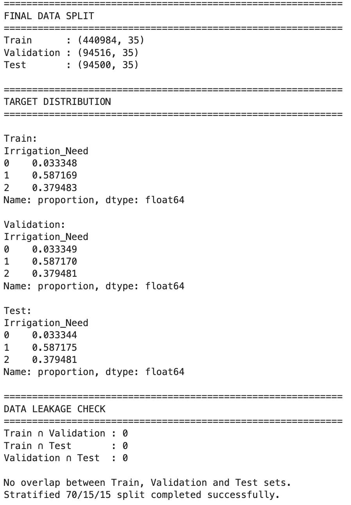
  <figcaption><b>Figure 3 — Final Stratified 70/15/15 Split and Leakage Check</b></figcaption>
</figure>

---

# 4. Moderate SMOTE Resampling

SMOTE was applied **only to the training data**.

Validation and test data were deliberately kept untouched.

### Training Distribution Before SMOTE

| Class | Samples |
|---:|---:|
| `0` — High | 14,706 |
| `1` — Low | 258,932 |
| `2` — Medium | 167,346 |

### Training Distribution After Moderate SMOTE

| Class | Samples |
|---:|---:|
| `0` — High | 100,000 |
| `1` — Low | 258,932 |
| `2` — Medium | 200,000 |

Training samples:

```text
Before SMOTE : 440,984
After SMOTE  : 558,932
```

Synthetic samples generated:

```text
High   : 14,706  → 100,000   (+85,294)
Low    : 258,932 → 258,932   (+0)
Medium : 167,346 → 200,000   (+32,654)
```

This is **moderate resampling**, not complete equalization. The objective was to substantially improve minority-class representation while avoiding unnecessary synthetic expansion of the majority class.

<figure>
  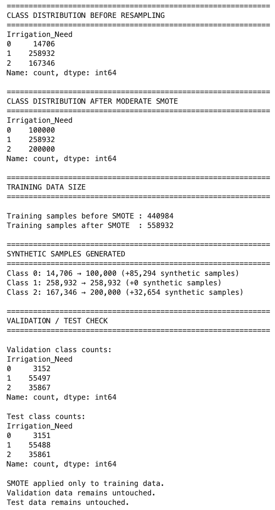
  <figcaption><b>Figure 4 — Moderate SMOTE Resampling and Validation/Test Integrity Check</b></figcaption>
</figure>

---

# 5. Model Training

Four models were trained and evaluated:

```text
                 ┌──────────────┐
                 │ Training Data│
                 └──────┬───────┘
                        │
              ┌─────────┴─────────┐
              │                   │
        Moderate SMOTE       Validation Data
              │                   │
              └─────────┬─────────┘
                        │
              ┌─────────┼─────────┐
              │         │         │
          CatBoost   XGBoost   LightGBM
              │         │         │
              └────┬────┴────┬────┘
                   │         │
             Logistic Regression
                   │
                   ▼
             Model Comparison
```

The boosting models use validation-based early stopping to reduce unnecessary iterations and improve generalization.

---

# 6. CatBoost Evaluation

### Training and Validation Results

CatBoost achieved strong performance across all three classes.

<figure>
  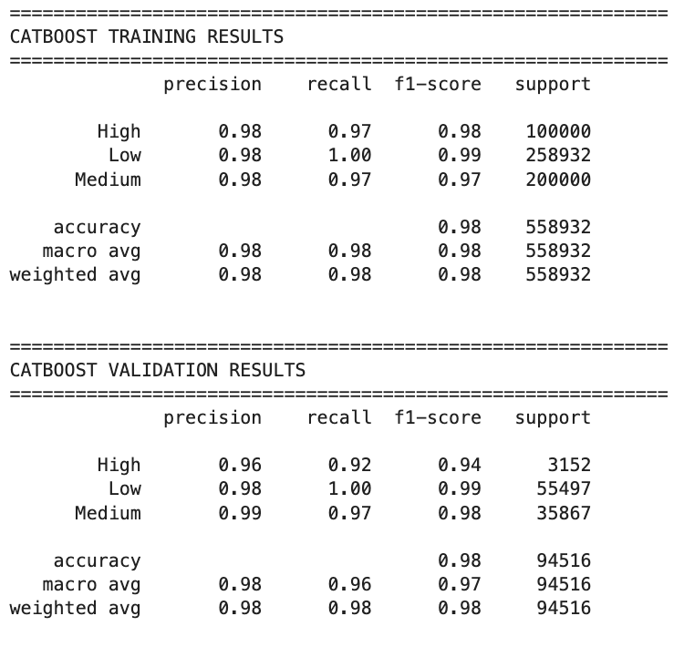
  <figcaption><b>Figure 5 — CatBoost Training and Validation Classification Results</b></figcaption>
</figure>

### CatBoost Performance

| Metric | Train | Validation | Test |
|---|---:|---:|---:|
| Accuracy | 0.9813 | 0.9843 | 0.9853 |
| Macro F1 | 0.9797 | 0.9697 | 0.9700 |

The High-class F1-score on the final test set was:

```text
High F1 = 0.9384
```

The generalization gaps were small:

```text
Train → Validation Accuracy Gap : -0.0030
Train → Test Accuracy Gap       : -0.0040

Train → Validation Macro F1 Gap : 0.0100
Train → Test Macro F1 Gap       : 0.0097
```

<figure>
  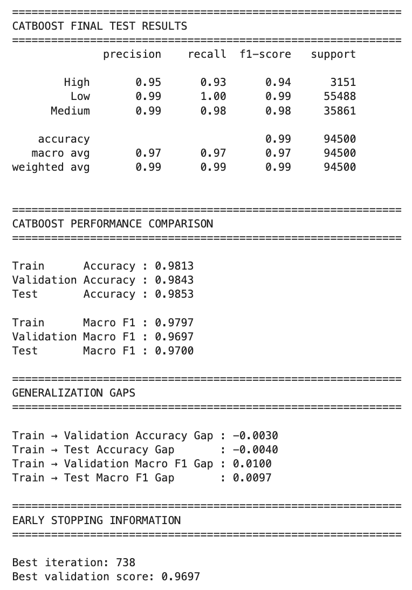
  <figcaption><b>Figure 6 — CatBoost Performance, Generalization Gap and Early Stopping</b></figcaption>
</figure>

<figure>
  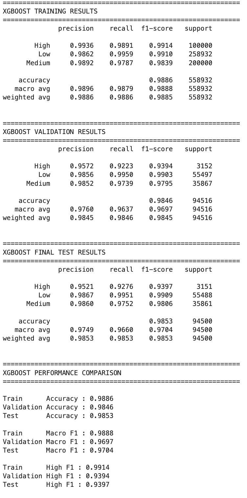
  <figcaption><b>Figure 7 — CatBoost Final Test Results</b></figcaption>
</figure>

---

# 7. LightGBM Evaluation

LightGBM also produced very strong results.

### LightGBM Performance

| Metric | Train | Validation | Test |
|---|---:|---:|---:|
| Accuracy | 0.9918 | 0.9845 | 0.9852 |
| Macro F1 | 0.9926 | 0.9705 | 0.9705 |
| High F1 | 0.9969 | 0.9418 | 0.9403 |

The generalization gaps remained small:

```text
Train → Validation Accuracy Gap : 0.0040
Train → Test Accuracy Gap       : 0.0032

Train → Validation Macro F1 Gap : 0.0190
Train → Test Macro F1 Gap       : 0.0184
```

<figure>
  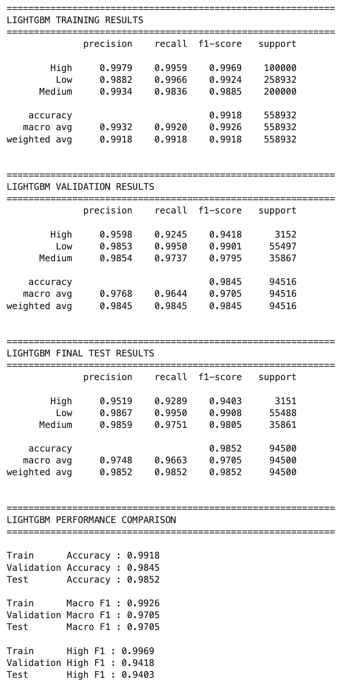
  <figcaption><b>Figure 8 — LightGBM Training, Validation and Test Results</b></figcaption>
</figure>

<figure>
  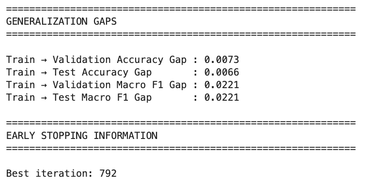
  <figcaption><b>Figure 9 — LightGBM Generalization Gap and Early Stopping</b></figcaption>
</figure>

---

# 8. XGBoost Evaluation

XGBoost produced highly consistent performance across training, validation, and test sets.

### XGBoost Performance

| Metric | Train | Validation | Test |
|---|---:|---:|---:|
| Accuracy | 0.9886 | 0.9846 | 0.9853 |
| Macro F1 | 0.9888 | 0.9697 | **0.9704** |
| High F1 | 0.9914 | 0.9394 | **0.9397** |

The final test classification report shows:

| Class | Precision | Recall | F1-score |
|---|---:|---:|---:|
| **High** | 0.9521 | 0.9276 | **0.9397** |
| **Low** | 0.9867 | 0.9951 | **0.9909** |
| **Medium** | 0.9860 | 0.9752 | **0.9806** |

### XGBoost Generalization

```text
Train → Validation Accuracy Gap : 0.0040
Train → Test Accuracy Gap       : 0.0033

Train → Validation Macro F1 Gap : 0.0191
Train → Test Macro F1 Gap       : 0.0184
```

The small train-to-validation/test gaps indicate strong generalization without a large performance collapse on unseen data.

---

# 9. Logistic Regression Baseline

Logistic Regression was included as a classical baseline.

Its final test performance was substantially lower than the tree-based ensemble models.

| Metric | Train | Validation | Test |
|---|---:|---:|---:|
| Accuracy | 0.8024 | 0.8176 | 0.8196 |
| Macro F1 | 0.7854 | 0.6862 | 0.6894 |
| High F1 | 0.7503 | 0.4148 | 0.4202 |

The most important limitation was the weak High-class F1-score:

```text
Validation High F1 : 0.4148
Test High F1       : 0.4202
```

Therefore, Logistic Regression was not selected for production deployment.

<figure>
  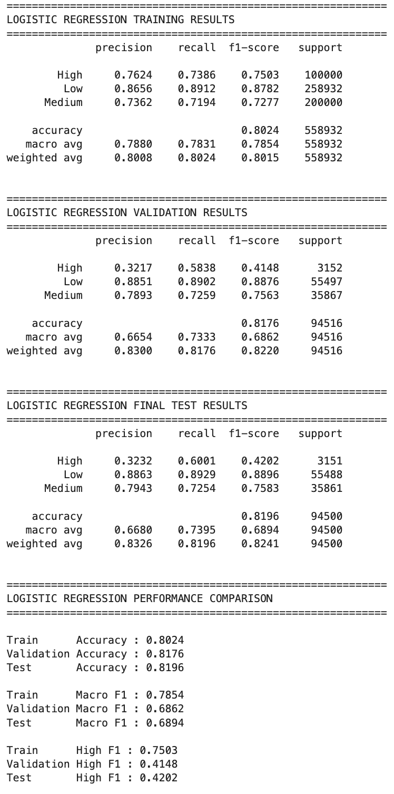
  <figcaption><b>Figure 10 — Logistic Regression Training, Validation and Test Results</b></figcaption>
</figure>

<figure>
  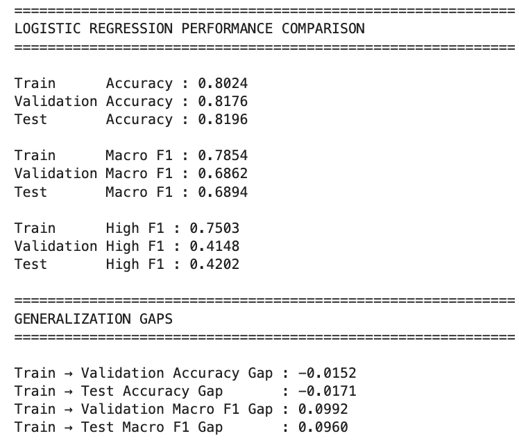
  <figcaption><b>Figure 11 — Logistic Regression Performance and Generalization Analysis</b></figcaption>
</figure>

---

# 10. Model Comparison

The validation/test Macro F1 comparison shows that all three boosting models perform around 0.97 Macro F1 on unseen data, while Logistic Regression is considerably lower.

| Model | Validation Macro F1 | Test Macro F1 | Test High F1 |
|---|---:|---:|---:|
| **LightGBM** | 0.9705 | **0.9705** | 0.9403 |
| **XGBoost** | 0.9697 | **0.9704** | **0.9397** |
| **CatBoost** | 0.9697 | 0.9700 | 0.9384 |
| Logistic Regression | 0.6862 | 0.6894 | 0.4202 |

<figure>
  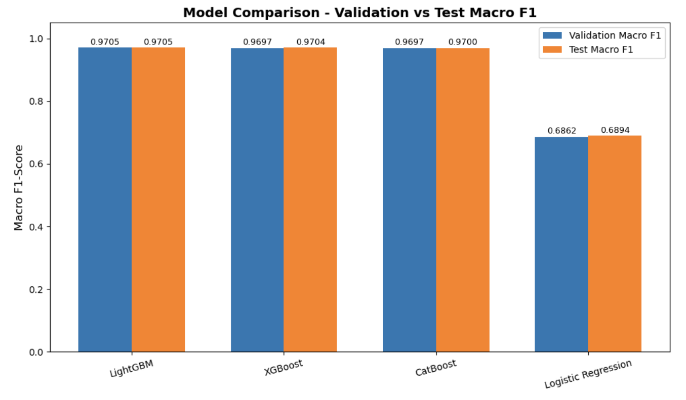
  <figcaption><b>Figure 12 — Validation vs Test Macro F1 Model Comparison</b></figcaption>
</figure>

### Why XGBoost Was Selected

Macro F1 alone does not show a decisive advantage for XGBoost — LightGBM has a marginally higher test Macro F1 (`0.9705` vs `0.9704`).

The final selection therefore uses the complete evaluation picture, especially probability-based ranking metrics.

XGBoost achieved the best:

- Macro ROC-AUC
- Micro Average Precision
- Overall test Macro F1 within the top-performing group
- Strong High-class F1
- Stable validation-to-test behaviour

Therefore:

> **XGBoost is the final production model.**

---

# 11. ROC-AUC Evaluation

Macro-average ROC curves were generated using one-vs-rest class probabilities.

### Final Test Macro ROC-AUC

| Model | Macro ROC-AUC |
|---|---:|
| CatBoost | 0.9972 |
| **XGBoost** | **0.9976** |
| LightGBM | 0.9975 |
| Logistic Regression | 0.9297 |

XGBoost achieved the highest Macro ROC-AUC:

```text
0.9976
```

<figure>
  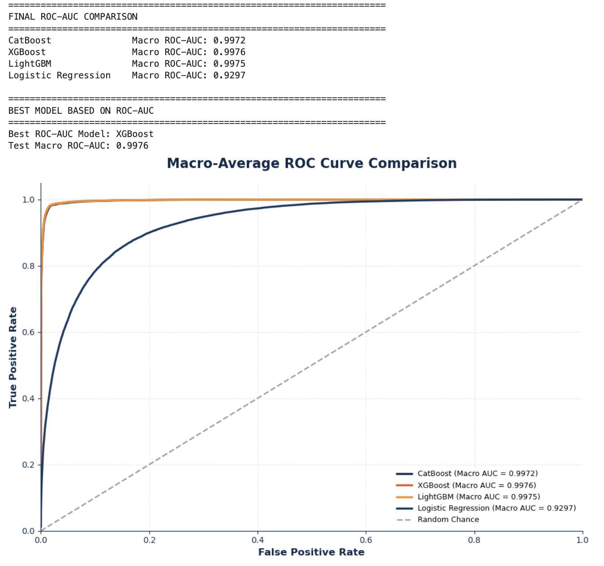
  <figcaption><b>Figure 13 — Macro-Average ROC-AUC Comparison</b></figcaption>
</figure>

---

# 12. Precision-Recall Evaluation

Micro-average Precision-Recall curves were evaluated on the untouched test set.

### Final Test Micro Average Precision

| Model | Micro Average Precision |
|---|---:|
| CatBoost | 0.9964 |
| **XGBoost** | **0.9970** |
| LightGBM | 0.9969 |
| Logistic Regression | 0.9034 |

XGBoost again achieved the best result:

```text
Micro Average Precision = 0.9970
```

<figure>
  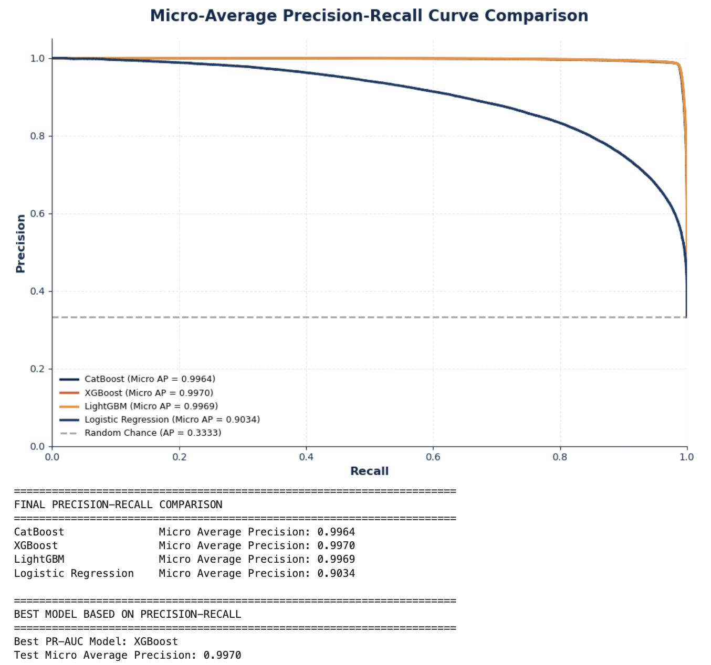
  <figcaption><b>Figure 14 — Micro-Average Precision-Recall Comparison</b></figcaption>
</figure>

---

# 13. Custom Threshold Analysis

After selecting XGBoost, custom probability thresholds were evaluated for the **High** irrigation-need class.

Tested thresholds:

```text
0.3
0.4
0.5
0.6
0.7
0.8
```

The analysis shows the trade-off created by increasing the High-class decision threshold.

At a threshold of `0.3`:

```text
True High predicted as High    : 2963
High predicted as Medium       : 188
```

At a threshold of `0.8`:

```text
True High predicted as High    : 2826
High predicted as Medium       : 325
```

Thus, increasing the threshold makes the model more conservative when assigning the High class.

<figure>
  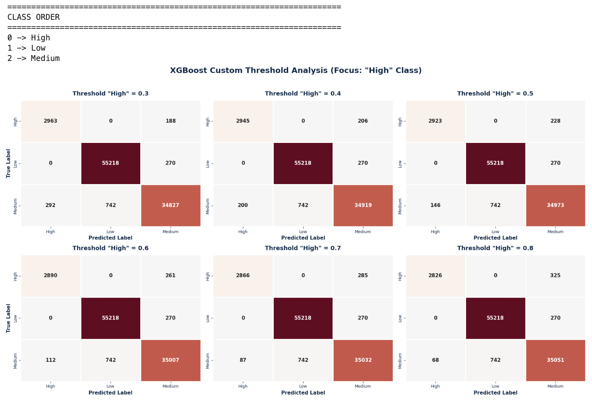
  <figcaption><b>Figure 15 — XGBoost Custom Threshold Analysis for High Irrigation Need</b></figcaption>
</figure>

---

# 14. XGBoost Feature Importance

The final XGBoost model uses **35 feature columns**.

The top features identified by the trained model are:

| Rank | Feature | Importance |
|---:|---|---:|
| 1 | `Crop_Growth_Stage_Sowing` | 0.209279 |
| 2 | `Mulching_Used_Yes` | 0.135162 |
| 3 | `Crop_Growth_Stage_Harvest` | 0.134313 |
| 4 | `Soil_Moisture` | 0.122873 |
| 5 | `Crop_Growth_Stage_Vegetative` | 0.069137 |
| 6 | `Temperature_C` | 0.067405 |
| 7 | `Wind_Speed_kmh` | 0.058130 |
| 8 | `Rainfall_mm` | 0.028858 |
| 9 | `Water_Source_River` | 0.018222 |
| 10 | `Water_Source_Rainwater` | 0.014148 |

Other influential features include water source, crop type, irrigation type, soil type, region, and season.

<figure>
  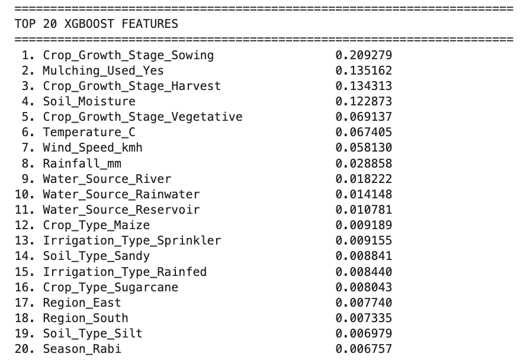
  <figcaption><b>Figure 16 — Top 20 XGBoost Features</b></figcaption>
</figure>

<figure>
  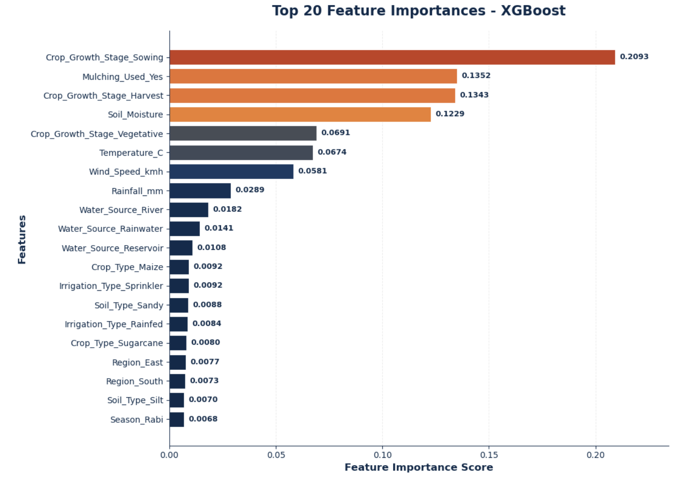
  <figcaption><b>Figure 17 — Top 20 XGBoost Feature Importance Visualization</b></figcaption>
</figure>

---

# 💾 15. Model Serialization

Once the final model was selected, the trained XGBoost classifier and exact feature-column order were serialized.

Generated artifacts:

```text
xgboost_model.pkl
model_columns.pkl
```

### Artifact Roles

**`xgboost_model.pkl`**

Contains the trained XGBoost classifier used during inference.

**`model_columns.pkl`**

Contains the exact ordered feature-column list expected by the trained model.

This is important because the Flask inference pipeline must reproduce the same One-Hot Encoded feature structure used during training.

<figure>
  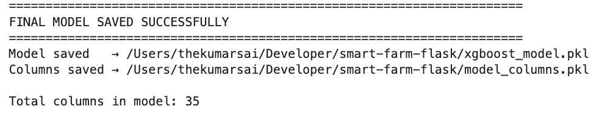
  <figcaption><b>Figure 18 — Final Model Artifacts Successfully Saved</b></figcaption>
</figure>

---

# 16. Deployment Architecture

The deployment architecture is intentionally lightweight:

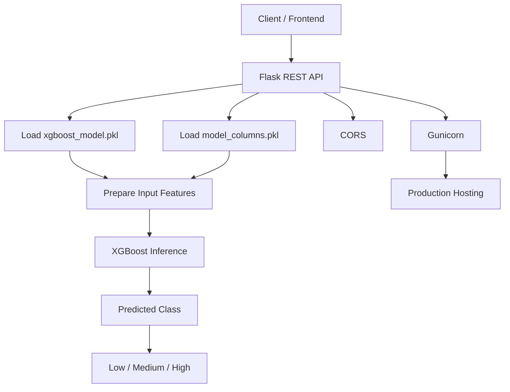
```mermaid
flowchart TD
    A["Client / Frontend"] --> B["Flask REST API"]
    B --> C["Load xgboost_model.pkl"]
    B --> D["Load model_columns.pkl"]

    C --> E["Prepare Input Features"]
    D --> E

    E --> F["XGBoost Inference"]
    F --> G["Predicted Class"]

    G --> H["Low / Medium / High"]

    B --> I["CORS"]
    B --> J["Gunicorn"]
    J --> K["Production Hosting"]
```

The deployed inference path is:

```text
Input Features
      ↓
Flask app.py
      ↓
Feature Preparation
      ↓
model_columns.pkl
      ↓
XGBoost Model
      ↓
Prediction
      ↓
Low / Medium / High
```

---

# 17. Training-to-Deployment Transition

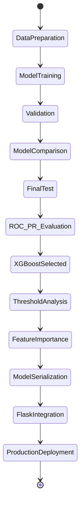
```mermaid
stateDiagram-v2
    [*] --> DataPreparation
    DataPreparation --> ModelTraining
    ModelTraining --> Validation
    Validation --> ModelComparison
    ModelComparison --> FinalTest
    FinalTest --> ROC_PR_Evaluation
    ROC_PR_Evaluation --> XGBoostSelected
    XGBoostSelected --> ThresholdAnalysis
    ThresholdAnalysis --> FeatureImportance
    FeatureImportance --> ModelSerialization
    ModelSerialization --> FlaskIntegration
    FlaskIntegration --> ProductionDeployment
    ProductionDeployment --> [*]
```

This separation ensures that experimentation and production inference are distinct stages.

---

# 18. Final Evaluation Checklist

Before deployment, the final model was checked for:

- [x] Stratified train/validation/test split
- [x] No overlap between datasets
- [x] No training data leakage into validation/test
- [x] SMOTE applied only to training data
- [x] Validation data kept untouched
- [x] Test data kept untouched
- [x] Multiple models benchmarked
- [x] Training performance evaluated
- [x] Validation performance evaluated
- [x] Final test performance evaluated
- [x] Generalization gaps inspected
- [x] Class-wise F1 evaluated
- [x] Macro F1 evaluated
- [x] ROC-AUC evaluated
- [x] Precision-Recall evaluated
- [x] Custom High-class thresholds evaluated
- [x] XGBoost feature importance analysed
- [x] Final XGBoost model serialized
- [x] Feature-column order serialized
- [x] Flask deployment path prepared

---

# 🏁 19. Final Model Performance

## Final Test Performance

| Model | Macro ROC-AUC | Micro Average Precision |
|---|---:|---:|
| CatBoost | 0.9972 | 0.9964 |
| **XGBoost** | **0.9976** | **0.9970** |
| LightGBM | 0.9975 | 0.9969 |
| Logistic Regression | 0.9297 | 0.9034 |

### Selected Model

> **XGBoost**

### Final Test Metrics

```text
Macro ROC-AUC              : 0.9976
Micro Average Precision    : 0.9970
Test Macro F1              : 0.9704
Test Accuracy              : 0.9853
Test High-Class F1         : 0.9397
```

The final model demonstrates strong discrimination and high overall classification quality on the untouched test set.

---

# 20. Project Artifacts

```text
precision-multiclass-irrigation-intelligence/
│
├── app.py
├── xgboost_model.pkl
├── model_columns.pkl
├── requirements.txt
├── Procfile
├── .python-version
│
├── notebook/
│   └── train_model.ipynb
│
├── templates/
│   └── ...
│
├── static/
│   └── ...
│
└── README.md
```

### Core Production Files

| File | Purpose |
|---|---|
| `app.py` | Flask inference application |
| `xgboost_model.pkl` | Final trained XGBoost model |
| `model_columns.pkl` | Ordered model feature columns |
| `requirements.txt` | Python dependencies |
| `Procfile` | Production server configuration |
| `.python-version` | Python runtime specification |
| `train_model.ipynb` | Complete ML experimentation/training workflow |

---

# Technology Stack

### Data & ML

- Python
- Pandas
- NumPy
- Scikit-learn
- XGBoost
- LightGBM
- CatBoost
- Imbalanced-learn / SMOTE

### Visualization

- Matplotlib
- Seaborn

### Model Persistence

- Joblib

### Backend

- Flask
- Flask-CORS

### Production

- Gunicorn
- Render

---

# 21. Run Locally

Clone the repository:

```bash
git clone https://github.com/kumarsainit/precision-multiclass-irrigation-intelligence.git
```

Move into the project:

```bash
cd precision-multiclass-irrigation-intelligence
```

Install dependencies:

```bash
pip install -r requirements.txt
```

Start the Flask server:

```bash
python app.py
```

For production-style execution:

```bash
gunicorn app:app
```

---

# 22. Deployment Flow

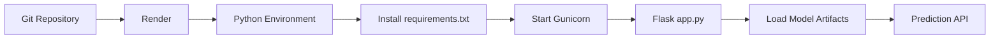
```mermaid
flowchart LR
    A["Git Repository"] --> B["Render"]
    B --> C["Python Environment"]
    C --> D["Install requirements.txt"]
    D --> E["Start Gunicorn"]
    E --> F["Flask app.py"]
    F --> G["Load Model Artifacts"]
    G --> H["Prediction API"]
```

The production inference service uses the serialized XGBoost model and saved feature-column configuration rather than retraining the model at request time.

---

# 23. Label Mapping Verification

The class mapping should always be verified from the fitted `LabelEncoder` before deployment:

```python
print(
    dict(
        zip(
            labelEncoder.classes_,
            labelEncoder.transform(labelEncoder.classes_)
        )
    )
)
```

For the completed training run, the observed class order is:

```text
0 → High
1 → Low
2 → Medium
```

This mapping must remain consistent during inference.

---

# 24. Important Data & Model Notes

### Data Integrity

The final split contains:

```text
Training   : 440,984 samples
Validation : 94,516 samples
Test       : 94,500 samples
```

No overlap was detected among these partitions.

### Resampling Integrity

SMOTE was applied only to the training set.

```text
Training    → SMOTE applied
Validation  → Untouched
Test        → Untouched
```

### Generalization

XGBoost shows a small train-to-test performance difference:

```text
Accuracy Gap  : 0.0033
Macro F1 Gap  : 0.0184
```

This supports the conclusion that the model generalizes well to unseen data.

---

# 25. Final Summary

**Precision Multi-Class Irrigation Intelligence** successfully implements a complete end-to-end machine-learning pipeline for crop irrigation-need prediction.

The project begins with an imbalanced agricultural dataset and applies careful preprocessing, target encoding, One-Hot Encoding, stratified data splitting, and controlled SMOTE resampling.

Four models were benchmarked:

```text
CatBoost
XGBoost
LightGBM
Logistic Regression
```

The three gradient-boosting models achieved strong classification performance, while Logistic Regression performed substantially worse, particularly on the High irrigation-need class.

The final evaluation on the **untouched test set** showed:

```text
XGBoost Macro ROC-AUC           = 0.9976
XGBoost Micro Average Precision = 0.9970
XGBoost Test Macro F1           = 0.9704
XGBoost Test Accuracy           = 0.9853
XGBoost High-Class F1           = 0.9397
```

XGBoost was therefore selected as the final deployment model because it achieved the strongest probability-based evaluation results while maintaining excellent class-wise classification performance and stable generalization.

The final model is serialized as:

```text
xgboost_model.pkl
```

and the exact feature-column configuration is stored as:

```text
model_columns.pkl
```

These artifacts are consumed by the Flask application to provide production inference.

The project therefore completes the full transition:

```text
Agricultural Data
      ↓
Preprocessing
      ↓
Feature Engineering
      ↓
Stratified Dataset Split
      ↓
Controlled SMOTE
      ↓
Model Benchmarking
      ↓
Validation
      ↓
Untouched Test Evaluation
      ↓
ROC-AUC + PR Analysis
      ↓
XGBoost Selection
      ↓
Threshold Analysis
      ↓
Feature Importance
      ↓
Model Serialization
      ↓
Flask API
      ↓
Gunicorn
      ↓
Production Deployment
```

## Final Status

**Model Training:** ✅ Complete  
**Model Evaluation:** ✅ Complete  
**Leakage Checks:** ✅ Passed  
**Generalization Checks:** ✅ Completed  
**ROC-AUC Analysis:** ✅ Complete  
**Precision-Recall Analysis:** ✅ Complete  
**Threshold Analysis:** ✅ Complete  
**Feature Importance:** ✅ Complete  
**Model Serialization:** ✅ Complete  
**Flask Integration:** ✅ Ready  
**Deployment Configuration:** ✅ Ready  

> **Final Production Model: XGBoost**

